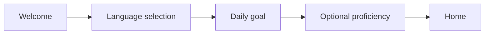
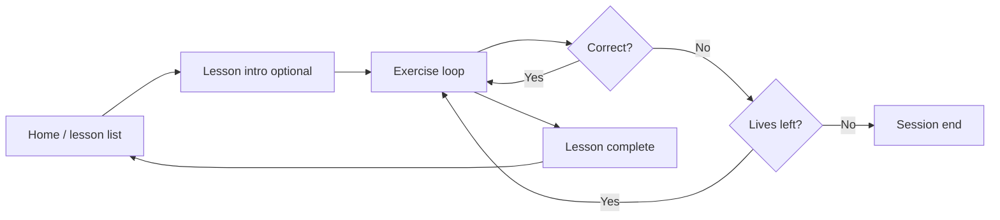

# Verbivy — UI/UX Design Guide

A comprehensive design system derived from the Verbivy language-learning app reference screens. Use this document when building screens, components, and interactions in the mobile app.

---

## Table of Contents

1. [Design Principles](#1-design-principles)
2. [Brand & Voice](#2-brand--voice)
3. [Color System](#3-color-system)
4. [Typography](#4-typography)
5. [Spacing & Layout](#5-spacing--layout)
6. [Elevation & Shape](#6-elevation--shape)
7. [Iconography & Illustration](#7-iconography--illustration)
8. [Component Library](#8-component-library)
9. [Screen Patterns](#9-screen-patterns)
10. [User Flows](#10-user-flows)
11. [Gamification & Feedback](#11-gamification--feedback)
12. [Motion & Interaction](#12-motion--interaction)
13. [Accessibility](#13-accessibility)
14. [Implementation Tokens](#14-implementation-tokens)

---

## 1. Design Principles

| Principle | Description |
|-----------|-------------|
| **Encouraging** | Every screen should feel supportive. Use warm copy, celebratory moments, and friendly illustrations—not punitive language. |
| **Clarity over density** | Generous white space. One primary action per screen. Instructions live in dedicated, visually distinct containers. |
| **Soft & approachable** | High corner radii, pastel accents, and rounded pill buttons reduce cognitive load and signal a learning-safe environment. |
| **Progressive disclosure** | Break onboarding and setup into small steps with visible progress. Never overwhelm with choices. |
| **Immediate feedback** | Selection states, progress bars, and lives update instantly. Users always know where they are and what they chose. |
| **Touch-first** | Minimum 44×44 pt tap targets. Large multiple-choice tiles. Full-width primary CTAs at thumb reach. |

---

## 2. Brand & Voice

### Product identity

- **Name:** Verbivy
- **Category:** Language learning
- **Personality:** Friendly, modern, lightly playful—not childish. Confident black CTAs balanced with soft lavender surfaces.

### Tone of voice

| Context | Tone | Example |
|---------|------|---------|
| Onboarding | Welcoming, personal | "Welcome to Verbivy, Sarah!" |
| Instructions | Clear, brief | "Listen and choose the correct word." |
| Success | Celebratory, warm | "Lesson Complete! Great job!" |
| Errors | Gentle, corrective | "Not quite—try again!" (avoid harsh red flash on wrong answers when lives remain) |
| Goals | Motivating, realistic | "Set Your Daily Learning Goal" |

### Emoji usage

Use emojis sparingly in **section headers** on the home screen to add warmth without cluttering instructional UI.

- ✅ Section titles: "Diverse Lesson Categories 📚", "Curated Lessons Just For You"
- ❌ Lesson instructions, error states, or dense lists

---

## 3. Color System

### Core palette

| Token | Hex | Usage |
|-------|-----|-------|
| `primary-action` | `#000000` | Primary buttons, key headings, play button fill |
| `primary-action-text` | `#FFFFFF` | Text on black buttons |
| `background` | `#FFFFFF` | Screen backgrounds |
| `background-subtle` | `#F8F8FA` | Optional alternate screen wash (very light gray) |
| `accent-lavender` | `#E8DFF5` | Instruction panels, progress bar fill, selected chip backgrounds |
| `accent-lavender-strong` | `#C9B8E8` | Progress bar active segment, stronger selection tint |
| `accent-peach` | `#FFE8D9` | Illustration accents, optional card tints |
| `accent-mint` | `#D4F0E4` | Illustration accents, optional success-adjacent surfaces |
| `border-default` | `#E5E5EA` | Unselected chips, card outlines, dividers |
| `border-selected` | `#9B7FD4` | Selected option border (purple) |
| `text-primary` | `#000000` | Headings, primary body |
| `text-secondary` | `#6B6B70` | Subtitles, helper text, metadata |
| `text-tertiary` | `#AEAEB2` | Placeholders, disabled labels |
| `status-error` | `#FF3B30` | Lives/hearts, notification badge |
| `status-success` | `#34C759` | Optional correct-answer confirmation |
| `notification-badge` | `#FF3B30` | Bell icon dot |

### Color application rules

1. **Black is reserved for action.** Primary CTAs and the audio play control use solid black. Do not use black for large background areas.
2. **Lavender signals context, not action.** Instruction boxes and progress use lavender; buttons inside them remain black.
3. **Borders over fills for unselected state.** Selection chips use a light gray border; selection adds purple border (and optionally a light lavender fill).
4. **Illustrations carry secondary color.** Orange, green, yellow appear in artwork—not as competing UI chrome.

### Semantic mapping

```
Action hierarchy:
  Primary CTA     → black pill, white text
  Secondary CTA   → outlined or text-only (e.g., "Back")
  Destructive     → rare; prefer soft messaging before red UI

State:
  Default         → white bg + gray border
  Selected        → purple border (+ optional lavender fill)
  Disabled        → 40% opacity, no shadow
  Active nav      → filled/darker icon vs. line icons
```

---

## 4. Typography

### Recommended typeface

**Primary:** Inter or SF Pro (system on iOS)  
**Fallback stack:** `Inter, ui-sans-serif, system-ui, -apple-system, sans-serif`

Geometric sans-serif with excellent legibility at small sizes on mobile.

### Type scale

| Token | Size | Weight | Line height | Letter spacing | Usage |
|-------|------|--------|-------------|----------------|-------|
| `display` | 28–32px | 700 | 1.2 | -0.5px | Screen titles ("Set Your Daily Learning Goal") |
| `title-lg` | 22–24px | 700 | 1.25 | -0.3px | Welcome headline, "Lesson Complete!" |
| `title-md` | 18–20px | 600 | 1.3 | 0 | Section headers on home |
| `body-lg` | 16–17px | 400 | 1.5 | 0 | Instructions, descriptions |
| `body-md` | 15px | 400 | 1.45 | 0 | Lesson list subtitles |
| `body-sm` | 13–14px | 400 | 1.4 | 0 | Metadata, progress labels |
| `label` | 14–15px | 600 | 1.2 | 0.2px | Chip labels, button text |
| `button` | 16–17px | 600 | 1 | 0.3px | Primary CTA label |
| `caption` | 12px | 500 | 1.3 | 0.4px | Badge text, timestamps |

### Hierarchy rules

- **One display-level title per screen.** Supporting copy steps down one level.
- **Section headers on home** use `title-md` + optional trailing emoji.
- **Instruction text** inside lavender panels uses `body-lg` in `text-primary` or `text-secondary` depending on emphasis.
- **Button text** is always semibold; never use all-caps except rare micro-labels.

---

## 5. Spacing & Layout

### Base unit

**4px grid.** All spacing should be multiples of 4.

### Standard spacing tokens

| Token | Value | Usage |
|-------|-------|-------|
| `space-xs` | 4px | Icon-to-label gaps |
| `space-sm` | 8px | Tight internal padding |
| `space-md` | 12px | Chip internal padding |
| `space-lg` | 16px | Screen horizontal padding, card padding |
| `space-xl` | 20px | Section gaps |
| `space-2xl` | 24px | Between major blocks |
| `space-3xl` | 32px | Hero illustration margin |
| `space-4xl` | 40–48px | Bottom CTA breathing room above safe area |

### Screen layout

```
┌─────────────────────────────────┐
│  Status bar (system)            │
├─────────────────────────────────┤
│  Top bar: back / progress / meta│  ← 56px content height
├─────────────────────────────────┤
│                                 │
│  Scrollable content             │  ← horizontal padding: 16–20px
│                                 │
│                                 │
├─────────────────────────────────┤
│  Fixed bottom CTA (optional)    │  ← 16px padding + safe area
├─────────────────────────────────┤
│  Tab bar (main app)             │  ← 49–56px + safe area
└─────────────────────────────────┘
```

### Content width

- Full-bleed horizontal scroll rows (category chips) break out of padding with `paddingHorizontal` on the scroll container only.
- Primary content column: **100% minus 32–40px** horizontal inset.

---

## 6. Elevation & Shape

### Corner radius

| Element | Radius |
|---------|--------|
| Primary / pill buttons | `9999px` (full pill) |
| Selection tiles (goal grid, quiz options) | `16–20px` |
| Instruction panel | `16px` |
| Lesson cards | `16–20px` |
| Category chips | `12px` |
| Thumbnails (lesson list) | `12px` |
| Bottom sheet (if used) | `24px` top corners |

### Shadows

Keep shadows **subtle or absent**. The aesthetic is flat with border definition.

| Level | Shadow | Usage |
|-------|--------|-------|
| None | — | Default cards on white |
| `sm` | `0 1px 3px rgba(0,0,0,0.06)` | Floating play button, optional cards |
| `md` | `0 4px 12px rgba(0,0,0,0.08)` | Modals only |

### Borders

- Default: `1px solid #E5E5EA`
- Selected: `2px solid #9B7FD4`
- Focus ring (a11y): `2px solid #9B7FD4` offset 2px

---

## 7. Iconography & Illustration

### Icons

- **Style:** Thin stroke, ~1.5–2px line weight, rounded caps
- **Size:** 24×24 default; 20×20 in compact nav; 28×28 for emphasis
- **Color:** `#000000` default; `#9B7FD4` or `#000000` when active in tab bar

**Tab bar icons (left → right):** Home, Library, Achievements, Community, Profile

**Common icons:** Back chevron, globe (language), bell (notifications), heart (lives), play (audio), activity/pulse (daily minutes)

### Illustrations

- Flat vector style with limited palette: orange, purple, green, yellow, black outlines optional
- Diverse characters; nature motifs (leaves, clouds)
- **Hero illustrations:** ~40–50% of viewport height on welcome/onboarding
- **Lesson thumbnails:** Square ~64–80px, rounded 12px, left-aligned in list rows

Do not mix illustration styles (no 3D or photographic assets in core UI).

---

## 8. Component Library

### 8.1 Primary button

Full-width pill at bottom of flow screens.

| Property | Value |
|----------|-------|
| Height | 52–56px |
| Background | `#000000` |
| Text | `#FFFFFF`, 16–17px semibold |
| Radius | Pill |
| States | Pressed: 92% opacity; Disabled: 40% opacity |

**Labels:** "Next", "Continue", "Start Learning" (context-dependent)

---

### 8.2 Secondary / ghost button

Text or outline for "Back", "Skip", tertiary actions.

- Text: `text-secondary` or black with underline
- Min touch target: 44×44px hit area even if visual is smaller

---

### 8.3 Selection chip / tile

Used for: daily goal minutes, quiz answers, language options.

| State | Background | Border | Text |
|-------|------------|--------|------|
| Default | `#FFFFFF` | 1px `#E5E5EA` | `#000000` |
| Selected | `#F5F0FC` optional | 2px `#9B7FD4` | `#000000` |
| Disabled | `#F8F8FA` | 1px `#E5E5EA` | `#AEAEB2` |

**Goal grid:** 2 columns, equal width, ~16px gap, tile min-height ~72px, centered label (e.g., "15 mins").

**Quiz options:** 2×2 grid or vertical stack of 4; large tiles with centered word text.

---

### 8.4 Category chip (horizontal scroll)

```
[ 🗣️ Speaking ] [ 📖 Reading ] [ ✍️ Writing ] ...
```

- Height: ~36–40px
- Padding: 12px horizontal
- Icon + label inline
- Inactive: white bg, gray border
- Active filter: lavender bg or purple border

---

### 8.5 Lesson list card

```
┌──────┬─────────────────────────────┐
│ thumb│  Lesson title               │
│      │  Short description          │
│      │              [Start Learning]│
└──────┴─────────────────────────────┘
```

| Property | Value |
|----------|-------|
| Layout | Row; thumbnail left |
| Thumbnail | 64–80px square, radius 12px |
| Title | `body-md` semibold |
| Description | `body-sm`, `text-secondary` |
| CTA | Small black pill button, bottom-right of text block |
| Spacing | 12px between thumbnail and text; 16px vertical between cards |

---

### 8.6 Instruction panel

Light lavender container for lesson prompts.

- Background: `#E8DFF5`
- Radius: 16px
- Padding: 16–20px
- Contains: instruction `body-lg`, optional subtext

---

### 8.7 Audio play button

Prominent centered control below instruction panel.

- Black pill, ~56px height, ~140px min width
- White play icon + optional "Play" label
- Subtle shadow optional

---

### 8.8 Top navigation bar

**Onboarding variant:**
- Left: back chevron
- Center: thin progress bar (track: `#E5E5EA`, fill: `#9B7FD4` or black)
- Right: empty or close on modal steps

**Lesson variant:**
- Left: close or back
- Center: lesson progress bar
- Right: lives (heart + count, red)

**Home variant:**
- Left: language selector chip (globe + "Spanish" + chevron)
- Center: daily goal ("0/30 minutes" + activity icon)
- Right: notification bell with red badge dot

---

### 8.9 Bottom tab bar

- Background: `#FFFFFF`
- Top border: `1px #E5E5EA` (or hairline shadow)
- 5 items, equal width
- Icon-only or icon + micro-label
- Active: darker/filled icon; inactive: `#AEAEB2`
- Safe area inset on bottom

---

### 8.10 Progress bar

| Variant | Track | Fill | Height |
|---------|-------|------|--------|
| Onboarding | `#E5E5EA` | `#9B7FD4` | 4px |
| Lesson | `#E5E5EA` | `#000000` or lavender | 4–6px |
| Daily goal | `#E5E5EA` | `#9B7FD4` | 6px (optional on home) |

---

### 8.11 Notification badge

- 8–10px red circle on bell icon upper-right
- No number required in reference; dot-only is sufficient for "unread"

---

### 8.12 Success / completion screen

- Centered layout
- Confetti emoji or illustration at top
- `title-lg`: "Lesson Complete!"
- `body-lg` `text-secondary`: encouraging subcopy
- Primary CTA: "Continue" or "Back to Home"

---

## 9. Screen Patterns

### 9.1 Welcome (onboarding)

| Zone | Content |
|------|---------|
| Hero | Large character illustration (~45% height) |
| Title | "Welcome to Verbivy, {Name}!" |
| Body | One line value proposition |
| Footer | Full-width black "Next" |

Personalize with user's name from prior step.

---

### 9.2 Daily goal setting

| Zone | Content |
|------|---------|
| Header | "Set Your Daily Learning Goal" |
| Subcopy | Brief explanation of why goals matter |
| Body | 2-column grid: 15 / 30 / 45 / 60 mins (or similar) |
| Footer | "Continue" disabled until selection made |

Single-select only. Selected tile gets purple border.

---

### 9.3 Home / dashboard

**Structure (top → bottom):**

1. Top bar (language, daily minutes, notifications)
2. "Diverse Lesson Categories 📚" + horizontal chip scroller
3. "Curated Lessons Just For You" + vertical lesson list
4. Bottom tab bar

Scrolling: entire content scrolls except fixed top bar and tab bar.

---

### 9.4 Lesson — listen & choose

**Structure:**

1. Top bar: progress + lives
2. Instruction panel (lavender)
3. Audio play button (centered)
4. 2×2 answer grid
5. No bottom CTA until answer submitted (or auto-advance on select)

Flow: play audio → select word → feedback → next question or completion.

---

### 9.5 Lesson complete

- Minimal chrome (no tab bar)
- Celebration + short message + single CTA
- Optional: XP, streak, or time spent (not in reference—keep minimal unless product requires)

---

## 10. User Flows

### Onboarding flow



**UX requirements:**

- Show step progress on every onboarding screen
- Allow back navigation without losing selections
- Persist choices locally before account creation
- First "Home" visit may show empty progress (0/30 minutes)—that's expected

### Learning session flow



### Navigation model

| Area | Pattern |
|------|---------|
| Onboarding | Linear stack + back |
| Main app | Tab bar (5 roots) + stack per tab |
| Lessons | Modal or stack overlay; close returns to previous context |

---

## 11. Gamification & Feedback

### Lives system

- Display: heart icon + numeric count (top-right in lessons)
- Color: red `#FF3B30`
- Decrement on wrong answer; optional refill daily or via achievements

### Daily goal

- Shown on home: `{elapsed}/{target} minutes`
- Activity/pulse icon adjacent
- Celebrate when target met (subtle banner or home card—not blocking modal)

### Progress

- Onboarding: segment progress in top bar
- Lessons: per-question or per-segment bar
- Long-term: consider streaks and achievements tab (icon present in nav)

### Answer feedback

| Result | Visual | Copy |
|--------|--------|------|
| Correct | Brief green tint or checkmark | Optional "Nice!" toast |
| Incorrect | Gentle shake or red border flash | "Try again" if retries allowed |
| Lesson done | Full success screen | "Great job!" |

Avoid punitive copy. Learning should feel safe.

---

## 12. Motion & Interaction

### Timing

| Interaction | Duration | Easing |
|-------------|----------|--------|
| Button press | 100–150ms | ease-out |
| Selection border | 200ms | ease-in-out |
| Screen transition | 300ms | iOS default or ease-in-out |
| Progress bar fill | 400ms | ease-out |
| Success confetti | 800–1200ms | spring optional |

### Micro-interactions

- **Chip select:** border color + scale 0.98 on press
- **Play audio:** icon pulse while playing
- **Tab switch:** cross-fade content, no flashy transitions
- **Pull to refresh:** optional on home lesson list

### Haptics (native)

- Light impact on selection
- Success notification on lesson complete
- Warning on life lost

---

## 13. Accessibility

### Minimum requirements

- **Contrast:** Black on white and white on black exceed WCAG AAA. Lavender panels must use dark text (`#000` or `#3A3A3C`), never light gray on lavender.
- **Touch targets:** 44×44pt minimum for all interactive elements.
- **Screen readers:** Label icon-only tab items; announce progress ("Question 3 of 10"); describe illustrations meaningfully or mark decorative.
- **Motion:** Respect `prefers-reduced-motion`; disable confetti and parallax.
- **Audio lessons:** Provide replay control; consider visual waveform for deaf/hard-of-hearing users in future iterations.

### Focus order

1. Top bar controls (back, language, notifications)
2. Main content (top to bottom, left to right in grids)
3. Primary CTA
4. Tab bar

---

## 14. Implementation Tokens

Suggested Tailwind / NativeWind extensions for this project:

```js
// tailwind.config.js — theme.extend
colors: {
  verbivy: {
    black: '#000000',
    white: '#FFFFFF',
    lavender: '#E8DFF5',
    'lavender-strong': '#C9B8E8',
    purple: '#9B7FD4',
    peach: '#FFE8D9',
    mint: '#D4F0E4',
    border: '#E5E5EA',
    'text-secondary': '#6B6B70',
    'text-tertiary': '#AEAEB2',
    error: '#FF3B30',
    success: '#34C759',
  },
},
borderRadius: {
  'verbivy-sm': '12px',
  'verbivy-md': '16px',
  'verbivy-lg': '20px',
  'verbivy-pill': '9999px',
},
spacing: {
  'screen-x': '16px',
  'screen-x-lg': '20px',
},
fontFamily: {
  sans: ['Inter', 'ui-sans-serif', 'system-ui', 'sans-serif'],
},
```

### Example class combinations

| Component | NativeWind classes (illustrative) |
|-----------|-----------------------------------|
| Primary button | `h-14 w-full rounded-full bg-black items-center justify-center` |
| Selected tile | `rounded-2xl border-2 border-verbivy-purple bg-verbivy-lavender/50 p-4` |
| Instruction panel | `rounded-2xl bg-verbivy-lavender p-5` |
| Lesson card | `flex-row gap-3 py-4` |
| Section title | `text-lg font-semibold text-black` |

---

## Appendix: Screen Inventory (Reference)

| # | Screen | Key components |
|---|--------|----------------|
| 1 | Welcome | Hero illustration, personalized title, Next CTA |
| 2 | Daily goal | Title, 2-col selection grid, Continue CTA |
| 3 | Home | Language chip, daily minutes, category scroller, lesson list, tab bar |
| 4 | Lesson | Progress, lives, instruction panel, play button, answer grid |
| 5 | Complete | Confetti, headline, subcopy, continue CTA |

---

## Changelog

| Date | Version | Notes |
|------|---------|-------|
| 2026-06-08 | 1.0 | Initial guide from Verbivy reference screenshot |

---

*This guide is a living document. Update tokens and patterns when new screens are designed or user testing reveals friction.*
